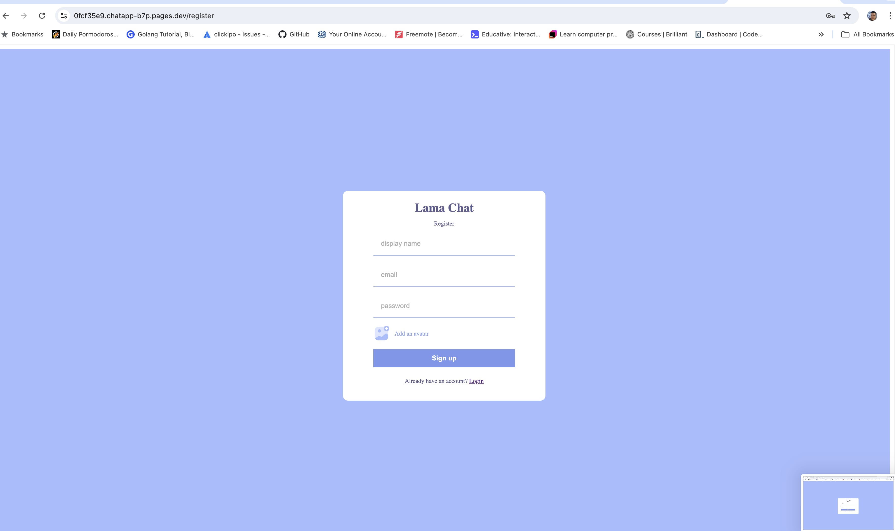
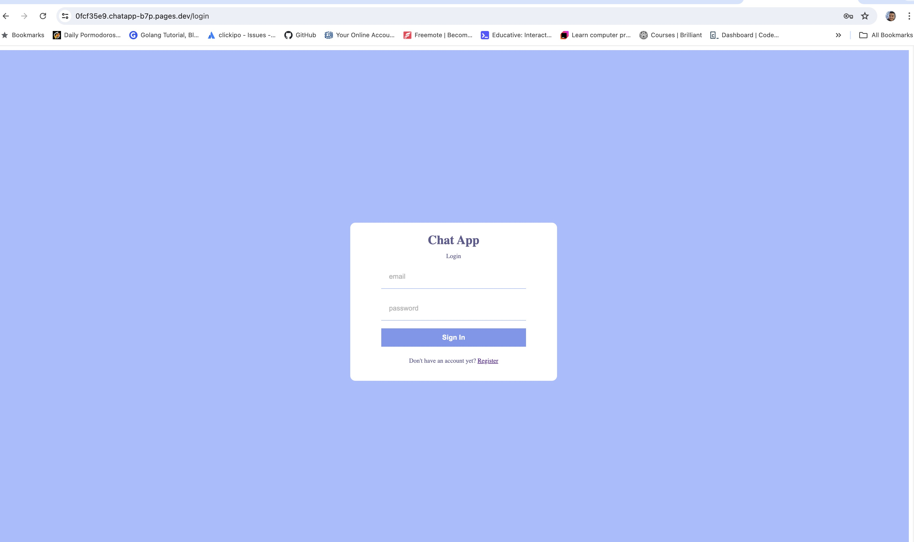
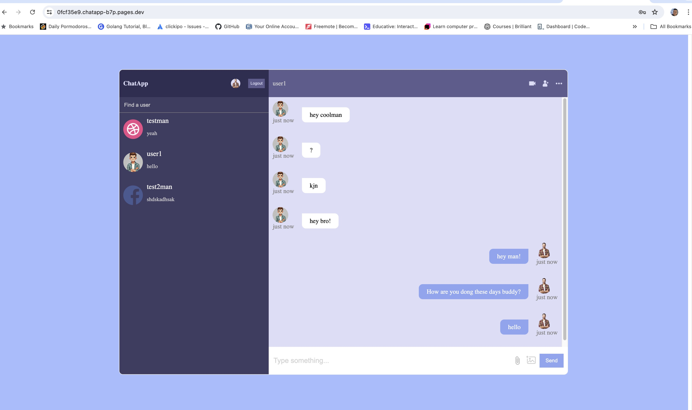
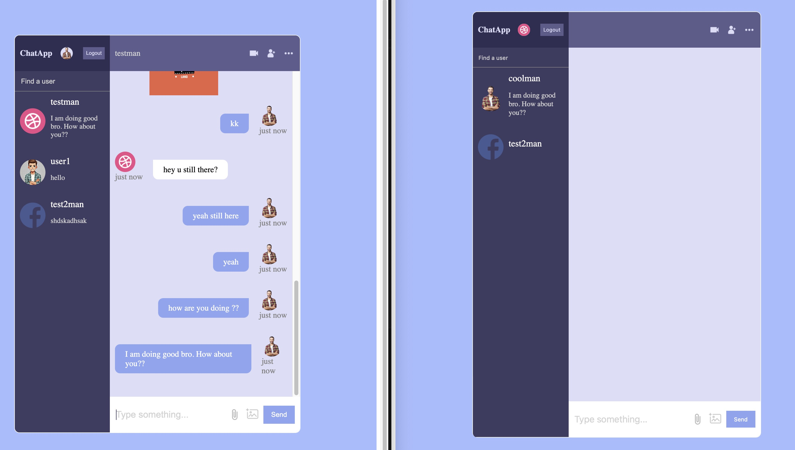

# Chat Application with Real-Time Notifications and User Interaction

Welcome to the Chat Application! This project is a real-time chat application built using React and Google Firebase. It features user authentication, new user registration, and real-time notifications, enabling seamless interaction among users.

## Table of Contents

- [Features](#features)
- [Installation](#installation)
- [Usage](#usage)
- [Application Images](#application-images)
- [License](#license)

## Features

- **Real-Time Chat**: Communicate with other users in real time.
- **User Authentication**: Secure login and signup using Firebase Authentication.
- **New User Registration**: Easily create new accounts.
- **Real-Time Notifications**: Receive notifications for new messages and interactions.
- **Responsive Design**: Optimized for both desktop and mobile devices.

## Installation

To get started with the project, follow these steps:

1. **Fork and Clone the repository:**
   ```sh
   git clone https://github.com/yourusername/chat-application.git
   cd chat-application
   ```

2. **Install dependencies:**
   ```sh
   npm install
   ```

3. **Setup Firebase:**
   - Create a Firebase project at [Firebase Console](https://console.firebase.google.com/).
   - Add a new web app to your Firebase project.
   - Copy the Firebase configuration and add it to your project.

4. **Configure Firebase:**
   - Create a `.env` file in the root of your project.
   - Add the following environment variables:
     ```
     REACT_APP_FIREBASE_API_KEY=your_api_key
     REACT_APP_FIREBASE_AUTH_DOMAIN=your_auth_domain
     REACT_APP_FIREBASE_PROJECT_ID=your_project_id
     REACT_APP_FIREBASE_STORAGE_BUCKET=your_storage_bucket
     REACT_APP_FIREBASE_MESSAGING_SENDER_ID=your_messaging_sender_id
     REACT_APP_FIREBASE_APP_ID=your_app_id
     ```

5. **Start the development server:**
   ```sh
   npm start
   ```

## Usage

1. **Register a new user:**
   - Click on the "Register" button on the login page.
   - Fill in the required details and submit.

2. **Login with an existing user:**
   - Enter your email and password on the login page and click "Login".

3. **Start chatting:**
   - Once logged in, you can start a new chat or join an existing chat room.
   - Receive real-time notifications for new messages.

## Application Images

### Register Page



### Login Page



### Chat Room



### Notifications



## License

This project is licensed under the MIT License. See the [LICENSE](LICENSE) file for more information.

---

Feel free to explore, use, and extend the project. 

Happy Coding!

---

### Contact Information
If you have any questions, feel free to reach out to the project maintainer:

**Chandra Lama**  
Email: iamme24cl@gmail.com  
GitHub: [chandralama](https://github.com/chandralama)
